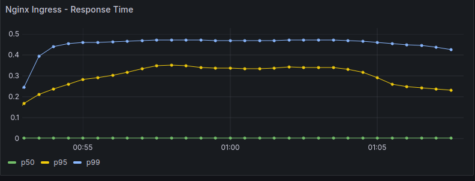
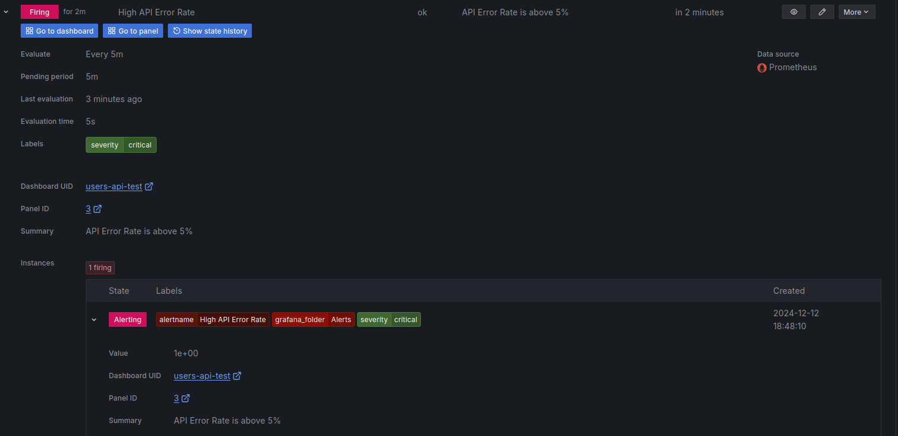

# Инструкция по работе с приложением

## Последние изменения и улучшения

### 1. Обработка ошибок в API (main.js)
- Добавлена детальная обработка ошибок с корректными HTTP-статусами
- Реализована дифференциация ошибок:
  - 400 Bad Request: ошибки валидации, неверный формат данных
  - 404 Not Found: ресурс не найден
  - 500 Internal Server Error: внутренние ошибки сервера
  - 503 Service Unavailable: проблемы с БД

### 2. Нагрузочное тестирование (load-test.js)
Создан скрипт для k6 с различными сценариями тестирования:

#### Тестируемые методы:
- POST /users (создание пользователей)
- GET /users (получение списка)
- GET /users/:id (получение по ID)
- DELETE /users/:id (удаление)

#### Сценарии тестирования:
- Успешные запросы
- Некорректные данные
- Невалидные ID
- Неподдерживаемые HTTP методы

## Развертывание приложения

### Предварительные требования

1. Minikube, с включенным ingress (--addons=ingress)
2. Helm (для установки СУДБ PostgreSQL)
3. k6 (для нагрузочного тестирования)

### Порядок установки

1. Примените секреты и конфигурации:
```bash
kubectl apply -f ./k8s/secret.yaml
kubectl apply -f ./k8s/configmap.yaml
```
2. Установите СУБД PostgreSQL из локального Helm-чарта:
```bash
helm install my-postgresql postgresql-chart/postgresql -f values.yaml
```
3. Запуск экспортера метрик PostgreSQL:
```bash
kubectl apply -f k8s/postgres-exporter.yaml
kubectl apply -f k8s/postgres-exporter-service.yaml
```
4. Запуск приложения:
```bash
kubectl apply -f k8s/app-deployment.yaml
kubectl apply -f k8s/app-service.yaml
```
5. Запуск мониторинга:
```bash
kubectl apply -f k8s/servicemonitor.yaml
kubectl apply -f k8s/postgres-servicemonitor.yaml
```
6. Настройка ingress:
```bash
kubectl apply -f k8s/ingress.yaml
kubectl apply -f k8s/ingress-nginx-controller-service.yaml
kubectl apply -f k8s/ingress-servicemonitor.yaml
```

### Проверка установки

1. Проверьте статус подов:
```bash
kubectl get pods
```
2. Проверьте статус сервисов:
```bash
kubectl get services
```
3. Проверьте доступность Ingress:
```bash
kubectl get ingress
```

## Мониторинг

### Метрики приложения

- http_request_duration_seconds
- http_requests_total
- Стандартные Node.js метрики
- Метрики PostgreSQL

### Grafana

В проекте доступны готовые дашборды:
- grafana-dashboard.json

Проброс порта для доступа к Grafana:
```bash
kubectl port-forward service/prometheus-grafana 3000:80
```

Для импорта дашбордов в Grafana:
1. Откройте Grafana UI
2. Перейдите в раздел Dashboards
3. Нажмите Import
4. Загрузите файл grafana-dashboard.json

## Нагрузочное тестирование

### Запуск тестов
```bash
k6 run load-test.js
```

### Сценарии тестирования

- Создание пользователей
- Получение списка пользователей
- Получение пользователя по ID
- Удаление пользователя
- Обработка ошибок

## Обработка ошибок

### HTTP статусы

- 400 Bad Request: ошибки валидации
- 404 Not Found: ресурс не найден
- 500 Internal Server Error: внутренние ошибки
- 503 Service Unavailable: проблемы с БД

### Диагностика проблем

1. Проверка статуса подов:
```bash
kubectl get pods
```
2. Проверка логов приложения:
```bash
kubectl logs -f <pod-name>
```
3. Проверка описания пода:
```bash
kubectl describe pod <pod-name>
```
4. Проверка метрик:
```bash
kubectl port-forward svc/prometheus-kube-prometheus-prometheus 9090:9090
curl http://localhost:9090/metrics
```

## Структура проекта

├── k8s/ # Kubernetes конфигурации <br />
│ ├── app-deployment.yaml <br />
│ ├── app-service.yaml <br />
│ ├── configmap.yaml <br />
│ ├── ingress-nginx-controller-service.yaml <br />
│ ├── ingress-servicemonitor.yaml <br />
│ ├── ingress.yaml <br />
│ ├── postgres-exporter-service.yaml <br />
│ ├── postgres-exporter.yaml <br />
│ ├── postgres-servicemonitor.yaml <br />
│ ├── secret.yaml <br />
│ └── servicemonitor.yaml <br />
├── main.js # Основной код приложения <br />
├── load-test.js # Скрипты нагрузочного тестирования <br />
├── grafana-dashboard.json # Дашбоард <br />
├── grafana-alerts.json # Алерты

## Удаление приложения

```bash
kubectl delete -f k8s/*
```

## Метрики Grafana, при проведении нагрузочного тестирования:

### Панели

1. API Error Rate <br />

2. API Response Time Quantiles <br />

3. CPU Usage <br />

4. Memory Usage <br />

5. Nginx Error Rate <br />

6. Nginx Request Rate <br />

7. Nginx Response Time <br />

8. PostgreSQL <br />

9. RPS <br />


### Алерты

1. High API Error Rate <br />

2. High API Latency <br />

