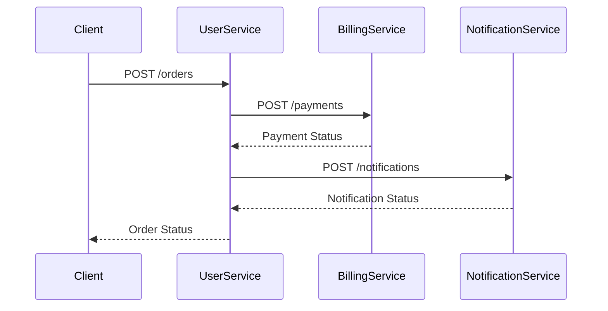
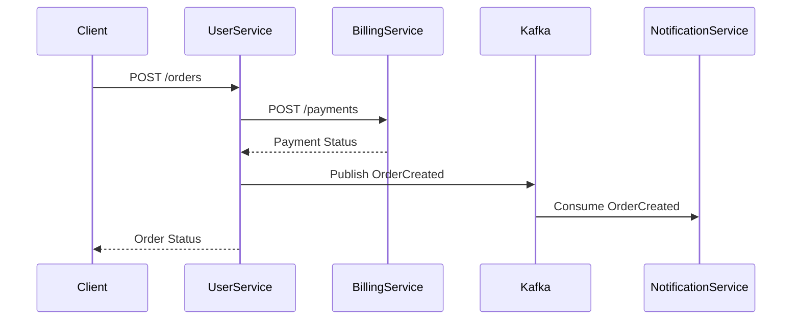
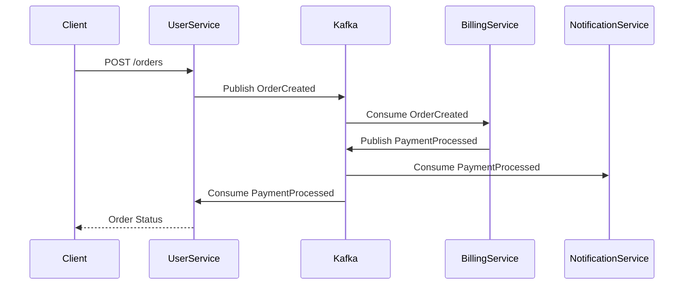
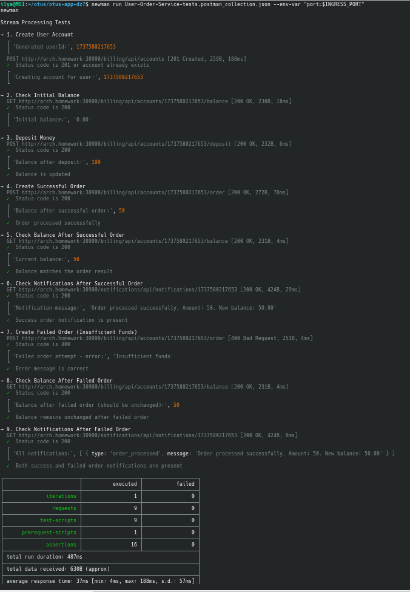

## Требования

1. Установленный Minikube, с включенным ingress (--addons=ingress)
2. Запущенный minikube tunnel (для возможности выполнения сетевых запросов к приложению)
2. Установленный Helm (для установки сервисов приложения)
3. Установленный newman (для проведения тестов готового приложения)

## Установка

1. Клонировать репозиторий:
```bash
git clone <repository-url>
cd <repository-name>
```

2. Установить зависимости при помощи Helm:
```bash
helm dependency update helm/
```

3. Создать namespace:
```bash
kubectl create namespace otus-app-dz7
```

4. Установите приложение:
```bash
helm install user-service helm/ -n otus-app-dz7
```

5. Проверьте статус подов:
```bash
kubectl get pods -n otus-app-dz7
```

6. Добавить запись для домена arch.homework в /etc/hosts (minikube ip)

```bash
192.168.49.2  arch.homework
```

7. Определить переменную INGRESS_PORT для доступа к сервисам:

```bash
export INGRESS_PORT=$(kubectl get svc -n ingress-nginx ingress-nginx-controller -o jsonpath='{.spec.ports[0].nodePort}')
```

## Технологический стек

- Node.js (для микросервисов)
- PostgreSQL (хранение данных)
- Apache Kafka (брокер сообщений)
- Kubernetes (оркестрация)
- Helm (управление релизами)

## Архитектура

Приложение состоит из следующих компонентов:

- **User Service**: Управление пользователями и их аккаунтами
- **Billing Service**: Обработка платежей и управление балансом
- **Notification Service**: Отправка уведомлений
- **PostgreSQL**: База данных для хранения информации о пользователях, заказах и балансах
- **Kafka**: Брокер сообщений для асинхронного взаимодействия между сервисами

## Варианты взаимодействия сервисов

### 1. HTTP взаимодействие



API (в формате OpenAPI):
```yaml
paths:
  /orders:
    post:
      summary: Create new order
      requestBody:
        content:
          application/json:
            schema:
              type: object
              properties:
                userId:
                  type: string
                amount:
                  type: number
  /payments:
    post:
      summary: Process payment
      requestBody:
        content:
          application/json:
            schema:
              type: object
              properties:
                orderId:
                  type: string
                amount:
                  type: number
  /notifications:
    post:
      summary: Send notification
      requestBody:
        content:
          application/json:
            schema:
              type: object
              properties:
                userId:
                  type: string
                message:
                  type: string
```

### 2. Событийное взаимодействие для нотификаций



События Kafka:
```protobuf
message OrderCreated {
    string orderId = 1;
    string userId = 2;
    double amount = 3;
    string status = 4;
    timestamp createdAt = 5;
}
```

### 3. Event Collaboration стиль



События Kafka:
```protobuf
message OrderCreated {
    string orderId = 1;
    string userId = 2;
    double amount = 3;
    timestamp createdAt = 4;
}

message PaymentProcessed {
    string orderId = 1;
    string status = 2;
    timestamp processedAt = 3;
}

message NotificationSent {
    string orderId = 1;
    string userId = 2;
    string message = 3;
    timestamp sentAt = 4;
}
```

### Рекомендуемый подход

Для данного приложения рекомендуется использовать Event Collaboration стиль взаимодействия (вариант 3), так как он обеспечивает:

- Слабую связанность между сервисами
- Асинхронную обработку операций
- Надежность доставки сообщений
- Возможность масштабирования каждого сервиса независимо
- Сохранение истории событий для аудита и отладки

## Тестирование при помощи newman

Для тестирования используется Postman-коллекция с переменными окружения:

Запустим тестирование:

```bash
newman run stream-processing-tests.postman_collection.json \
    --env-var "port=$INGRESS_PORT"
```

Коллекция включает тесты для:
- Создания пользователя
- Проверки баланса
- Внесения средств
- Создания заказа
- Проверки уведомлений

> **Примечание**: В Postman-коллекции используются переменные окружения `{{host}}` и `{{port}}` вместо хардкода значений. Это позволяет запускать тесты в разных окружениях без модификации самой коллекции.

Вывод тестирования newman <br />


## Мониторинг

Для просмотра логов сервисов:

```bash
# Логи User Service
kubectl logs -n otus-app-dz7 deployment/user-service

# Логи Billing Service
kubectl logs -n otus-app-dz7 deployment/billing-service

# Логи Notification Service
kubectl logs -n otus-app-dz7 deployment/notification-service
```

## Известные проблемы и решения

1. Если Kafka не запускается, проверьте:
   - Доступность Zookeeper
   - Наличие и права доступа к PVC
   - Корректность конфигурации listeners

2. Если сервисы не могут подключиться к Kafka:
   - Проверьте правильность DNS-имени в конфигурации
   - Убедитесь, что init-контейнеры корректно ожидают готовности Kafka

3. Проблемы с доступом к сервисам:
   - Убедитесь, что Ingress Controller установлен и работает
   - Проверьте правильность настройки /etc/hosts
   - Убедитесь, что используется правильный порт Ingress Controller
   - Для облачных провайдеров настройте DNS или используйте внешний IP LoadBalancer 