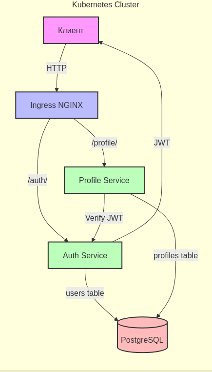

Для запуска потребуется:

1. Установленный Minikube, с включенным ingress (--addons=ingress)
2. Установленный Helm (для установки сервисов приложения)
3. Установленный Postman (для проведения тестов готового приложения)

## Установка

1. Создать namespace:

```bash
kubectl create namespace otus-users-dz6
```

2. Установить зависимости Helm чарта:

```bash
cd helm
helm dependency update
```

3. Установить приложение:

```bash
helm install user-profile-dz6 ./helm -n otus-users-dz6
```

4. Добавить в /etc/hosts:

```bash
127.0.0.1 arch.homework
```

## Проверка установки

1. Проверить, что все поды запущены:

```bash
kubectl get pods -n otus-users-dz6
```

Должны быть запущены:
- auth-service-*
- profile-service-*
- postgresql-*

2. Проверить логи сервисов:

```bash
# Логи auth-service
kubectl logs -f deployment/auth-service -n otus-users-dz6

# Логи profile-service
kubectl logs -f deployment/profile-service -n otus-users-dz6
```

3. Проверить доступность сервисов:

```bash
# Проверка auth-service
curl -i http://arch.homework/auth/health

# Проверка profile-service
curl -i http://arch.homework/profile/health
```

# Архитектурное решение

Схема <br />

## Общее описание
Система реализована в виде микросервисной архитектуры и состоит из следующих компонентов:

1. **Auth Service** - сервис аутентификации и авторизации:
   - Регистрация пользователей
   - Аутентификация (login)
   - Генерация JWT токенов
   - Хранение учетных данных пользователей в PostgreSQL

2. **Profile Service** - сервис управления профилями пользователей:
   - Получение данных профиля
   - Обновление данных профиля
   - Проверка JWT токенов для авторизации
   - Хранение профилей в PostgreSQL

3. **PostgreSQL** - база данных:
   - Хранение пользователей (таблица users)
   - Хранение профилей (таблица profiles)

4. **Ingress NGINX** - входная точка API:
   - Маршрутизация запросов к сервисам
   - Терминация HTTPS (если настроено)
   - Балансировка нагрузки

## Процесс взаимодействия

1. **Регистрация**:
   - Клиент отправляет POST /auth/register
   - Auth Service создает пользователя в БД
   - Возвращается JWT токен

2. **Аутентификация**:
   - Клиент отправляет POST /auth/login
   - Auth Service проверяет credentials
   - Возвращается JWT токен

3. **Работа с профилем**:
   - Клиент отправляет запрос с JWT токеном
   - Profile Service проверяет токен
   - Profile Service выполняет операции с профилем
   - Возвращаются данные профиля

## Безопасность

- Все запросы к Profile Service требуют валидный JWT токен
- Каждый пользователь имеет доступ только к своему профилю
- Пароли и чувствительные данные хранятся в Kubernetes Secrets
- Межсервисное взаимодействие происходит внутри кластера Kubernetes

## При помощи Postman проведем тестирование приложения

Запустить тесты:

```bash
postman collection run User-Profile-Tests.postman_collection.json
```

Вывод Postman <br />
